# Arquitetura da solução

Este documento descreve o **domínio** (DDD), os **componentes**, o **fluxo das principais operações**
(diagramas de sequência), o **modelo de dados** e a **implantação** do Finora. Os diagramas usam
[Mermaid](https://mermaid.js.org/), que o GitHub desenha automaticamente ao abrir este arquivo.

**Sumário:**

1. [Domínio: subdomínios e bounded contexts](#1-domínio-subdomínios-e-bounded-contexts)
2. [Diagrama de componentes](#2-diagrama-de-componentes)
3. [Componentes internos de cada microsserviço](#3-componentes-internos-de-cada-microsserviço)
4. [Topologia de mensagens (RabbitMQ)](#4-topologia-de-mensagens-rabbitmq)
5. [Diagramas de sequência](#5-diagramas-de-sequência)
6. [Modelo de dados](#6-modelo-de-dados)
7. [Histórico de mudanças dos dados](#7-histórico-de-mudanças-dos-dados)
8. [Arquitetura orientada a eventos: prós e contras](#8-arquitetura-orientada-a-eventos-prós-e-contras)
9. [Diagrama de implantação (Kubernetes)](#9-diagrama-de-implantação-kubernetes)
10. [Evolução da arquitetura](#10-evolução-da-arquitetura)

---

## 1. Domínio: subdomínios e bounded contexts

O domínio do Finora é o **controle financeiro pessoal**: o usuário registra receitas e despesas e
acompanha o saldo por meio de relatórios.

| Subdomínio | Tipo | Por quê | Bounded context | Onde vive |
|---|---|---|---|---|
| **Transações** (receitas e despesas) | **Núcleo** (*core*) | É o motivo de o sistema existir; concentra as regras de negócio | Transações | `finora` (módulo `transaction`) |
| **Relatórios** (saldo, extrato em Excel) | **Suporte** (*supporting*) | Necessário para o negócio, mas deriva dos dados do núcleo | Relatórios | `reports-service` |
| **Identidade** (cadastro, login, JWT) | **Genérico** (*generic*) | Problema comum a qualquer sistema; sem regra específica do negócio | Identidade | `finora` (módulo `auth`) |

### Mapa de contextos

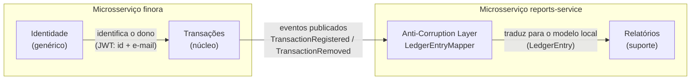

- **Transações → Relatórios** é uma relação **produtor/consumidor por eventos** (*published language*):
  o contexto de Transações publica fatos no RabbitMQ sem conhecer quem os consome.
- O contexto de Relatórios protege o próprio modelo com uma **Anti-Corruption Layer**
  (`LedgerEntryMapper`): a mensagem externa (`TransactionEventMessage`) vira um `LedgerEntry` e,
  na geração, um `ReportEntry`, conceitos do próprio contexto.
- Cada contexto tem **banco próprio** (`finora` e `finora_reports`): nenhum serviço lê a base do outro.

### Blocos táticos do DDD

| Conceito | Contexto de Transações (`finora`) | Contexto de Relatórios (`reports-service`) |
|---|---|---|
| Agregado (raiz) | `Transaction` (sem setters; criação só pela fábrica `Transaction.register`) | `FinancialReport` (ciclo `REQUESTED → READY / FAILED`, lock otimista `@Version`) |
| Value Objects | `Money` (positivo, 2 casas, igualdade por valor), `TransactionType` | `ReportPeriod`, `ReportSummary`, `ReportEntry`, `ReportFile` |
| Serviço de domínio | — | `BalanceCalculator` (receitas − despesas = saldo) |
| Eventos de domínio | `TransactionRegistered`, `TransactionRemoved` (interface `DomainEvent`) | `ReportRequested` |
| Portas (interfaces do domínio) | — | `TransactionSource`, `ReportExporter` |
| Adaptadores | `TransactionRepository` (Spring Data) | `LedgerTransactionSource`, `ExcelReportExporter` (Apache POI) |
| Serviço de aplicação | `TransactionService` | `ReportService`, `ReportGenerationService`, `LedgerProjectionService` |
| Exceções de domínio | `InvalidTransactionException`, `TransactionNotFoundException` | `InvalidReportPeriodException`, `ReportNotReadyException`, … |

---

## 2. Diagrama de componentes

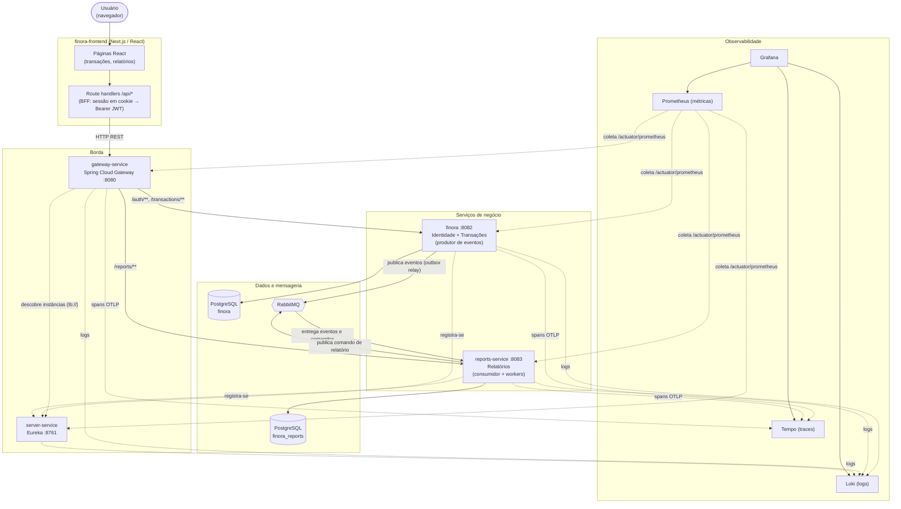

| Componente | Responsabilidade | Tecnologia |
|---|---|---|
| Front-end | Interface e BFF (guarda o JWT em cookie `httpOnly`, repassa como `Bearer`) | Next.js 16, React 19 |
| `gateway-service` | Porta única de entrada; roteia por caminho e balanceia entre réplicas | Spring Cloud Gateway (WebFlux) |
| `server-service` | Registro e descoberta de serviços | Spring Cloud Netflix Eureka |
| `finora` | Cadastro/login (JWT) e transações; grava eventos na outbox | Spring Boot, Spring Security, JPA, AMQP |
| `reports-service` | Projeção dos lançamentos, geração assíncrona do Excel, histórico de relatórios | Spring Boot, JPA, AMQP, Apache POI |
| RabbitMQ | Broker de eventos e comandos, com DLX/DLQ | RabbitMQ 4 |
| PostgreSQL (2) | Um banco por serviço (*database per service*) | PostgreSQL 13 |
| Loki / Tempo / Prometheus / Grafana | Logs, traces, métricas e painéis | Pilha Grafana LGTM |

> A autenticação é validada **em cada serviço de negócio** (filtro `JwtAuthenticationFilter`, mesma
> chave `JWT_SECRET`); o gateway apenas roteia.

---

## 3. Componentes internos de cada microsserviço

### finora — camadas e outbox

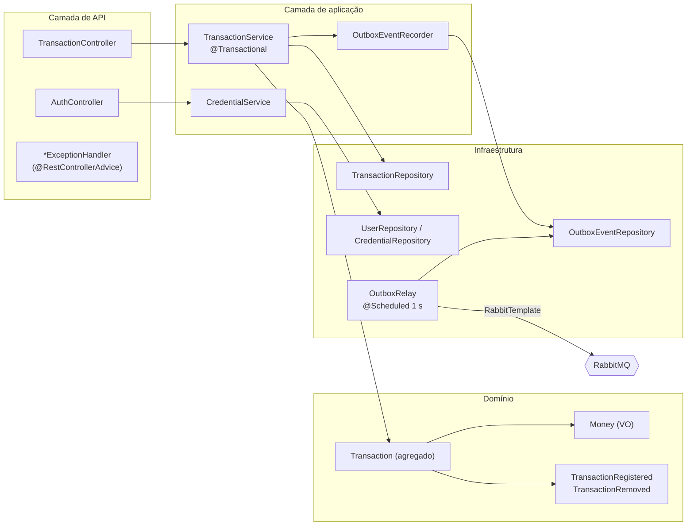

### reports-service — portas e adaptadores

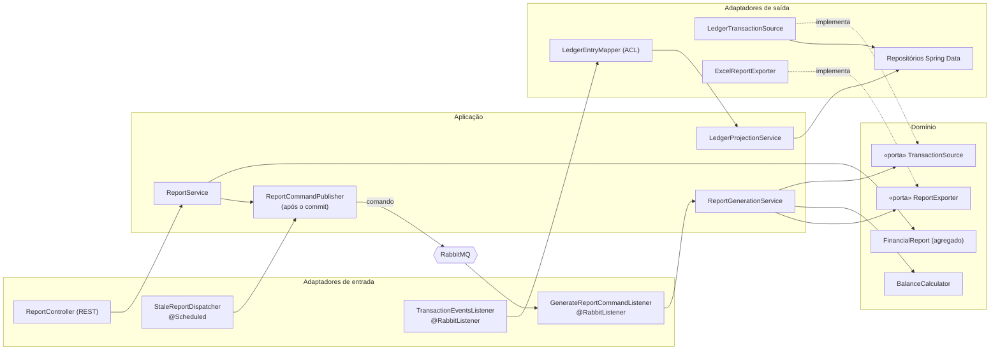

As **portas** (`TransactionSource`, `ReportExporter`) são interfaces do domínio; as implementações
ficam na infraestrutura. Assim o cálculo do relatório não depende de JPA nem do Apache POI
(**inversão de dependência**, o "D" do SOLID) e trocar o Excel por PDF significa criar outro
adaptador, sem mexer no domínio (**aberto/fechado**, o "O").

---

## 4. Topologia de mensagens (RabbitMQ)

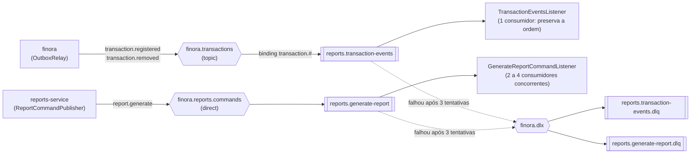

| Mensagem | Tipo | Significado |
|---|---|---|
| `TransactionRegistered` / `TransactionRemoved` | **Evento** (fato passado, vários consumidores possíveis) | "Uma transação foi registrada/removida" |
| `GenerateReportCommand` | **Comando** (pedido a um único destinatário) | "Gere o relatório X" |

---

## 5. Diagramas de sequência

### 5.1 Login

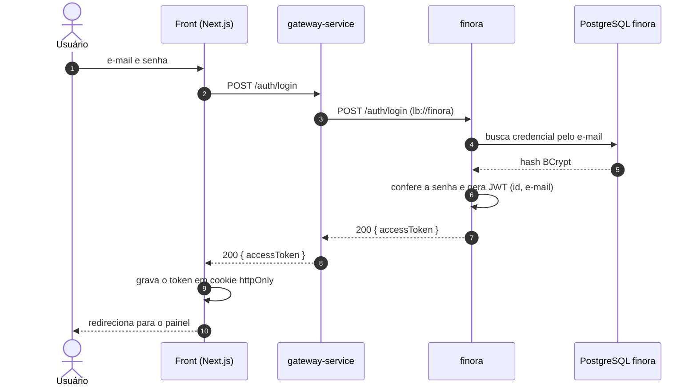

### 5.2 Registrar uma transação (evento + Transactional Outbox)

O ponto central: **salvar a transação e registrar o evento acontecem na mesma transação do banco**.
A publicação no RabbitMQ acontece depois, pelo relay. Assim nenhum evento se perde, mesmo com o
broker fora do ar.

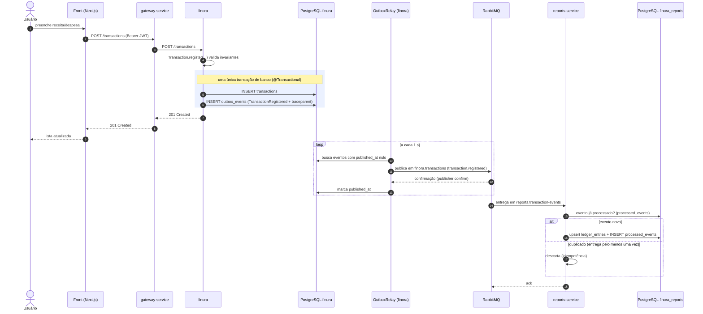

### 5.3 Remover uma transação (lápide)

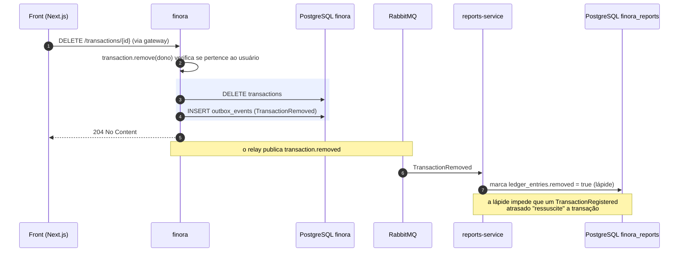

### 5.4 Gerar relatório (request-reply assíncrono)

O relatório **não é gerado dentro da requisição HTTP**: o serviço responde `202 Accepted` na hora e
um worker gera o arquivo. O front acompanha o status por polling.

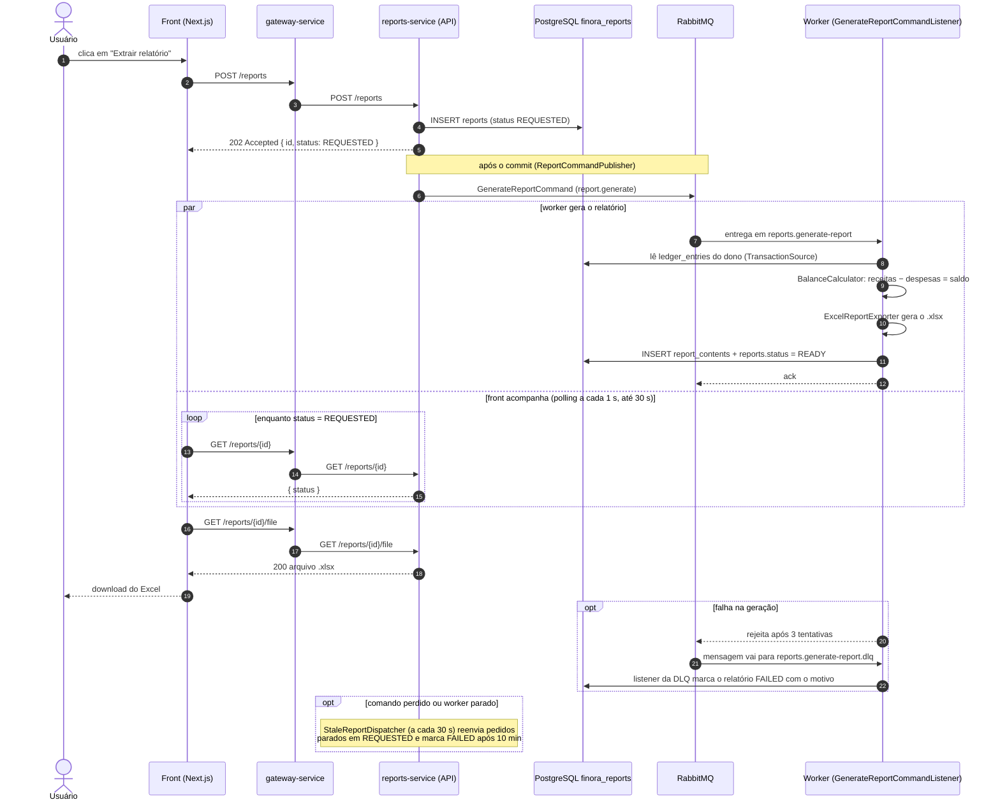

### 5.5 Rastreamento distribuído de uma transação

Como o `traceparent` viaja no HTTP, é guardado na outbox e segue no cabeçalho da mensagem, o
Tempo mostra a operação da seção 5.2 como **um único trace**:

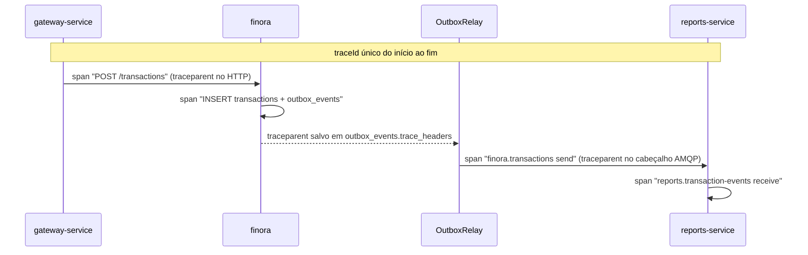

Detalhes em [monitoramento.md](monitoramento.md).

---

## 6. Modelo de dados

Cada serviço tem o próprio banco. Os dados foram modelados a partir das **consultas** que o sistema
faz (índices por dono e por status) e do **isolamento** entre contextos (o `reports-service` guarda
uma cópia mínima dos lançamentos, a projeção, em vez de consultar o banco do `finora`).

### Banco `finora` (contextos de Identidade e Transações)

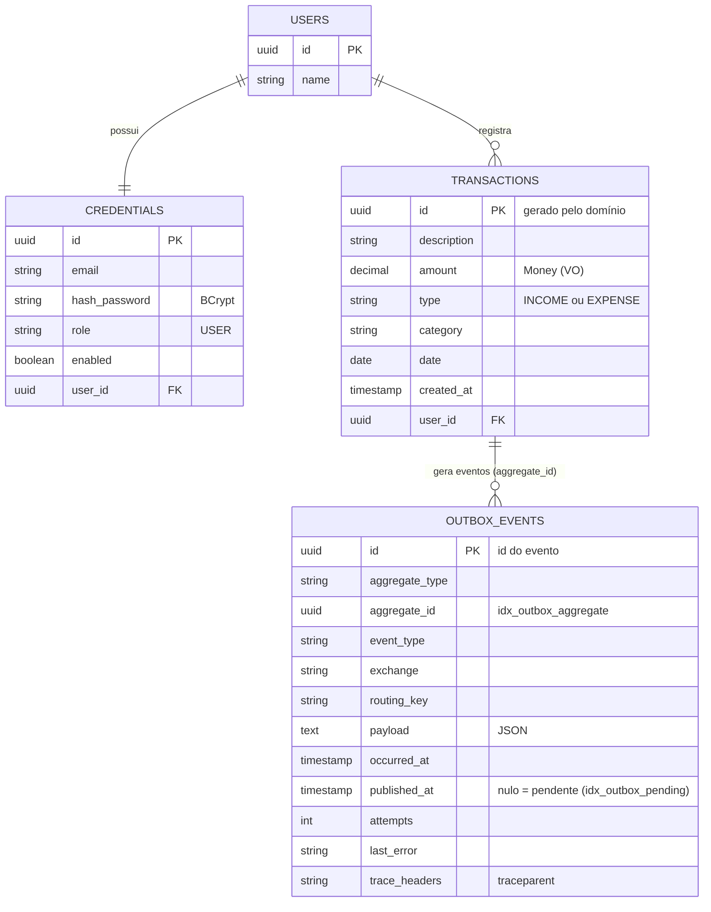

### Banco `finora_reports` (contexto de Relatórios)

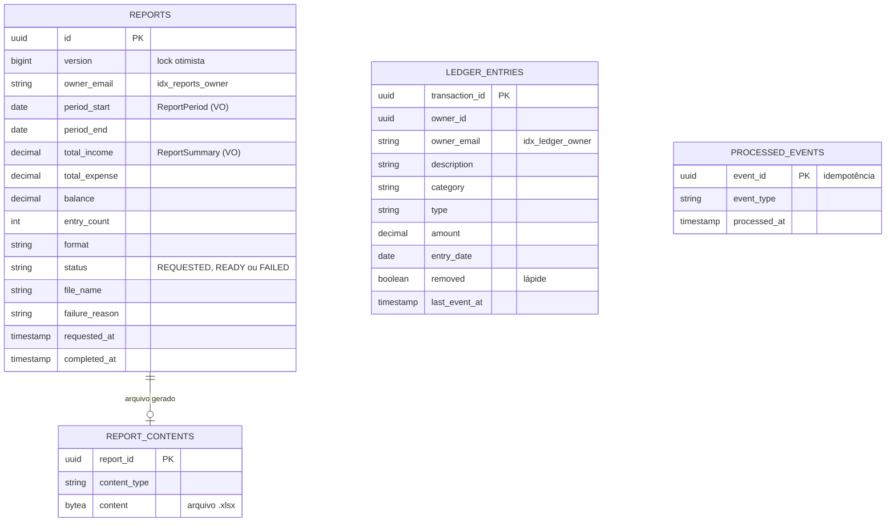

| Garantia | Como |
|---|---|
| Integridade das regras | Invariantes nos agregados (`Money` positivo, só o dono remove a transação, transições de status do relatório) |
| Atomicidade | `@Transactional` nos serviços de aplicação; transação e evento gravados juntos (outbox) |
| Concorrência | Lock otimista (`@Version`) em `FinancialReport` |
| Sem processamento duplicado | `processed_events` (chave = id do evento) |
| Desempenho | Índices criados a partir das consultas: `idx_reports_owner`, `idx_reports_status`, `idx_ledger_owner`, `idx_outbox_pending`, `idx_outbox_aggregate` |

---

## 7. Histórico de mudanças dos dados

O sistema guarda o histórico em três lugares, cada um com um propósito:

| Onde | O que registra | Como consultar |
|---|---|---|
| `outbox_events` (finora) | **Todo** registro e remoção de transação, em ordem, com data do fato (`occurred_at`) e da publicação (`published_at`) — um *log* de eventos de domínio | Banco (`SELECT … ORDER BY occurred_at`) e Grafana (métricas `finora_outbox_*`) |
| `ledger_entries` (reports) | Estado mais recente de cada transação, **sem apagar as removidas** (lápide `removed = true`) e com `last_event_at` | Usado pela geração dos relatórios |
| `reports` (reports) | Todos os relatórios pedidos, com período, totais, status e datas | **`GET /reports/history`** e tela de histórico no front |

Exemplo de consulta do histórico de alterações de uma transação:

```sql
SELECT event_type, occurred_at, published_at, payload
FROM outbox_events
WHERE aggregate_id = '<id-da-transação>'
ORDER BY occurred_at;
```

---

## 8. Arquitetura orientada a eventos: prós e contras

Na arquitetura orientada a eventos (EDA), um serviço anuncia o que aconteceu ("transação
registrada") e segue em frente; quem se interessa reage quando puder. No Finora isso substituiu a
chamada síncrona `reports-service → finora` (OpenFeign) por mensagens no RabbitMQ.

### Prós

| Benefício | O que significa | No Finora |
|---|---|---|
| Baixo acoplamento | O produtor não conhece os consumidores | O finora publica eventos sem saber que o reports-service existe; um novo consumidor (ex.: notificações) entra sem mudar o finora |
| Resiliência | Uma falha não se propaga em cascata | Com o finora fora do ar, relatórios continuam sendo gerados a partir da projeção local; com o RabbitMQ fora, o finora continua aceitando transações (a outbox guarda os eventos) |
| Escalabilidade | Trabalho pesado vai para filas e é dividido entre workers | A geração do Excel sai da requisição HTTP e vai para uma fila com consumidores concorrentes; o HPA aumenta as réplicas |
| Absorção de picos | A fila acumula e os consumidores drenam no ritmo deles | Muitos pedidos de relatório ao mesmo tempo não derrubam o serviço |
| Autonomia de dados | Cada serviço mantém a própria cópia do que precisa | O reports-service guarda uma projeção dos lançamentos na base `finora_reports` |
| Auditoria | Eventos formam um histórico do que aconteceu | A tabela `outbox_events` registra todo evento emitido e quando foi publicado |

### Contras

| Custo | O que significa | Como tratamos |
|---|---|---|
| Consistência eventual | O consumidor fica alguns instantes atrás do produtor | Um lançamento criado agora aparece no relatório após ~1 a 2 s (intervalo do relay + consumo) |
| Mais infraestrutura | Um broker a mais para operar e monitorar | RabbitMQ em StatefulSet com volume, painel de gestão e métricas no Grafana |
| Entrega "pelo menos uma vez" | A mesma mensagem pode chegar duas vezes | Consumidor idempotente (`processed_events` + upsert por id) |
| Ordem e falhas parciais | Mensagens podem chegar fora de ordem ou falhar | Fila de eventos com um consumidor, lápides para exclusões, retry com backoff e DLQ |
| Depuração mais difícil | O fluxo não é uma pilha de chamadas | Rastreamento distribuído (Tempo), `traceId` nos logs (Loki), `messageId = eventId` |
| Dupla escrita (banco + broker) | Salvar e publicar não são atômicos | Transactional Outbox |

### Quando vale a pena

- **Vale:** vários serviços reagem ao mesmo fato; tarefas demoradas que não precisam de resposta
  imediata (relatórios, e-mails, exportações); picos de carga; integração entre bounded contexts
  que devem evoluir de forma independente.
- **Não vale:** o usuário precisa da resposta na hora e com consistência forte (ex.: login, validar
  saldo antes de um débito); sistemas pequenos com um único serviço, onde o broker só adiciona custo.
- **No Finora:** login e cadastro de transações continuam **síncronos** (o usuário precisa da
  confirmação). O que passou a usar eventos foi a **integração entre contextos** e a **geração de
  relatórios**.

---

## 9. Diagrama de implantação (Kubernetes)

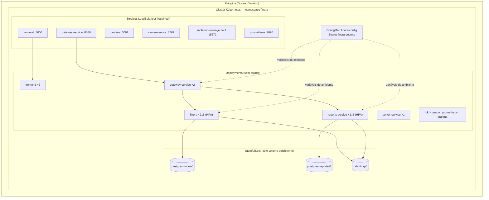

Detalhes (probes, HPA, PDB, rolling update) em [implantacao.md](implantacao.md); pipeline que
constrói e implanta as imagens em [ci-cd.md](ci-cd.md).

---

## 10. Evolução da arquitetura

| Versão | Entrega | Arquitetura |
|---|---|---|
| `v1.0.0` | TP1 | **Monólito** Spring Boot em camadas (controller → service → repository) com DDD no módulo de transações |
| `v2.0.0` | TP2 | **Microsserviços**: Eureka, API Gateway e `reports-service` com banco próprio, integrado ao finora por HTTP (OpenFeign) |
| `v3.0.0` | TP3/TP4 | **Orientada a eventos**: OpenFeign substituído por RabbitMQ (outbox, projeção, relatório assíncrono, DLQ, idempotência) |
| `v5.0.0` | TP5 | **Pronta para produção**: Docker, Kubernetes, observabilidade, testes abrangentes e CI/CD |
